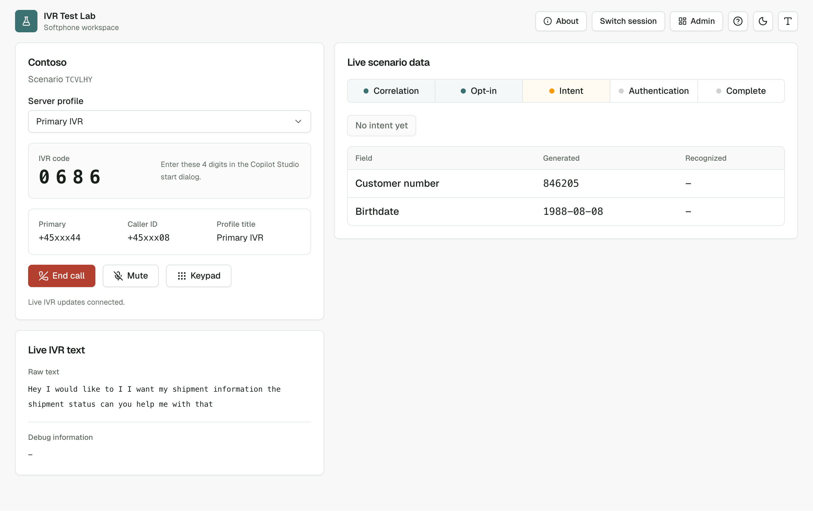
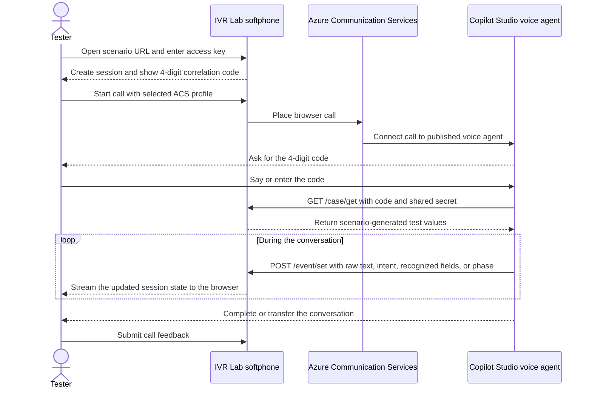
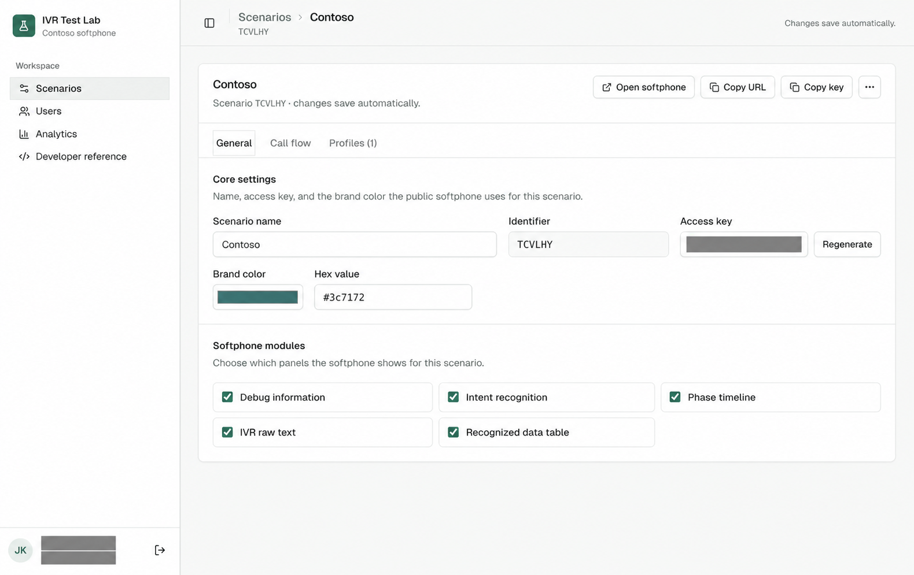
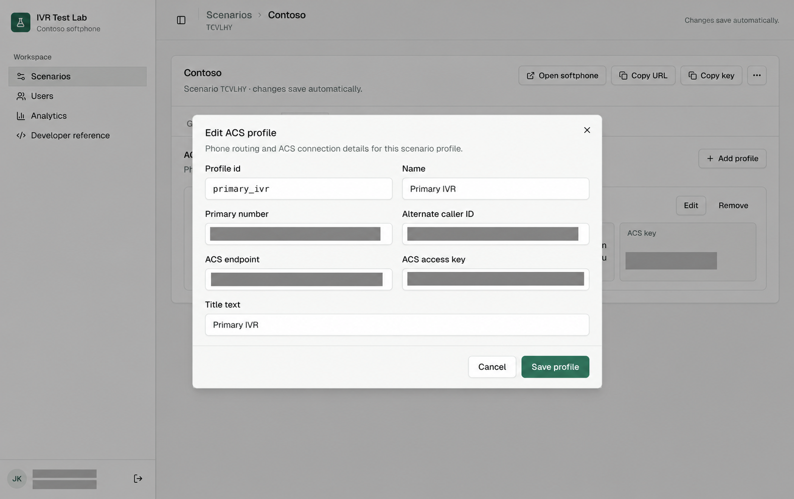
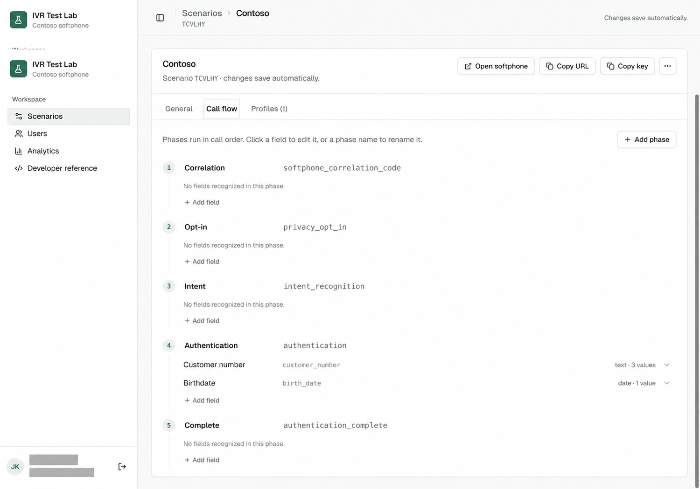
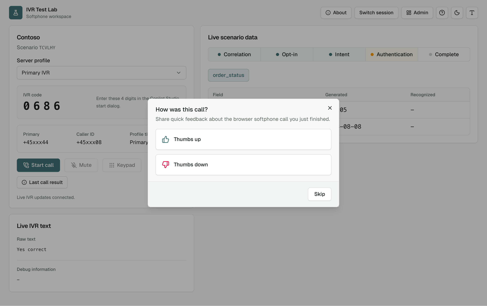
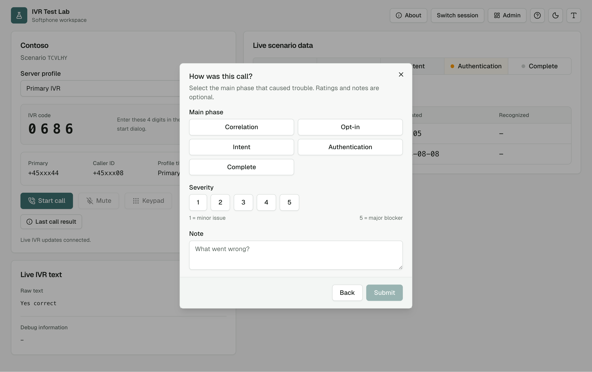
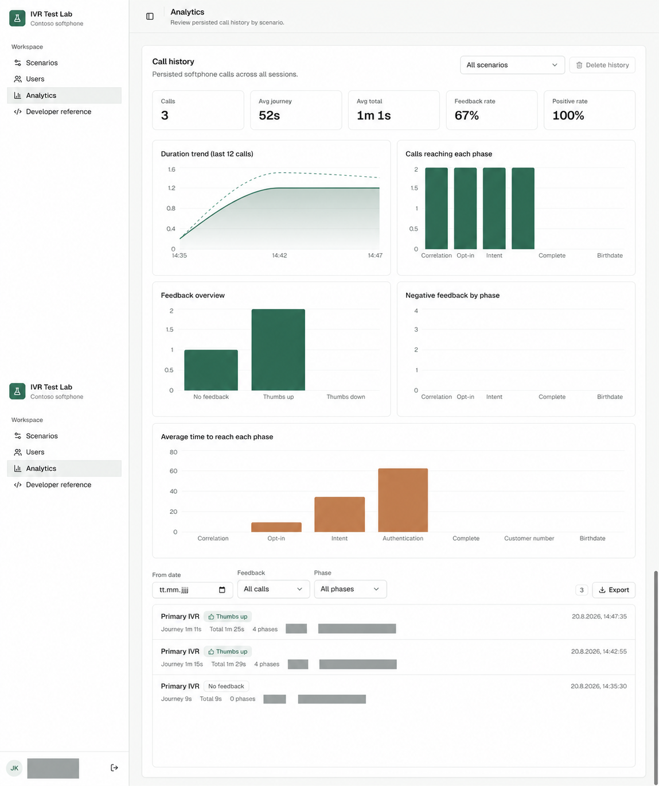

# IVR Lab for Copilot Studio Voice Bots

IVR Lab shortens the feedback loop between building a Copilot Studio voice agent and proving that it works with real callers. Automated evaluations are a strong first step, but production-ready IVR flows must also be tested by people—with different languages, accents, phrasing, and behavior. IVR Lab replaces disconnected call scripts, Excel trackers, and unstructured notes with a browser-based test harness that gives each tester clear instructions and generated test data, places the real call through Azure Communication Services (ACS), captures the conversation state in real time, and ties structured feedback to the call. The resulting data closes the loop: teams can measure outcomes, identify weak dialogs, and use the evidence with GitHub Copilot to improve their Copilot Studio flows faster.



## What's inside

- **Public landing (`/`)** — narrow entry point; softphone access is available only through a scenario link and access key.
- **Softphone (`/softphone/$scenarioId`)** — tester-facing call console with call controls, DTMF, generated case data, recognized fields, phases, raw text, debug information, and post-call feedback.
- **Admin workspace (`/admins/*`)** — scenario authoring, ACS profiles, user and role management, call analytics, and developer integration information.
- **Public API (`/api/public/softphone/*`)** — endpoints used by Copilot Studio to retrieve test data and publish events into the correlated live session.

## Stack

TanStack Start (React 19, file-based routes) · Bun · SQLite via Drizzle · better-auth · Azure Communication Services · Tailwind 4 + shadcn/ui + Fluent UI (admin area).

## How the call flow works



The four-digit correlation code is the bridge between the phone call and the browser session. It is temporary and valid only while that softphone session exists.

## Prerequisites

- [Bun](https://bun.sh/) for local development or Docker for container deployment.
- A public HTTPS host for end-to-end testing. Copilot Studio cannot call a development server on `localhost`.
- An Azure Communication Services resource that can issue calling tokens and place PSTN calls.
- A published Copilot Studio voice agent and permission to create solution environment variables and edit topic YAML.
- A Google or GitHub OAuth application if the admin workspace will be used.

## Setup

### 1. Configure and run IVR Lab

Install dependencies and create the local environment file:

```bash
bun install
cp .env.example .env
```

At minimum, configure these values in `.env`:

```dotenv
DB_FILE_NAME=.data/app.db
BETTER_AUTH_SECRET=<strong-random-value>
BETTER_AUTH_URL=http://localhost:5173
APP_URL=http://localhost:5173
SOFTPHONE_EXTERNAL_WRITE_SECRET=<strong-random-value-shared-with-copilot-studio>

# Configure at least one admin sign-in provider.
GOOGLE_CLIENT_ID=<oauth-client-id>
GOOGLE_CLIENT_SECRET=<oauth-client-secret>
AUTH_ADMIN_EMAILS=admin@example.com
```

See [.env.example](.env.example) for all supported settings and GitHub OAuth alternatives.

Generate independent secrets, for example:

```bash
openssl rand -base64 32
openssl rand -hex 32
```

Apply the database migrations and start the development server:

```bash
bun run db:migrate
bun run dev
```

The local app runs at [http://localhost:5173](http://localhost:5173). For a deployed environment, set `BETTER_AUTH_URL` and `APP_URL` to the public HTTPS origin and persist the SQLite directory.

ACS credentials are configured per scenario in the admin workspace; they are not read from the Copilot Studio environment variables described below.

### 2. Create an IVR Lab scenario

Sign in to the admin workspace and create a scenario. Configure:

1. A scenario name, five-digit access key, and optional brand color.
2. At least one **ACS profile**:
   - **Primary number** — the destination number connected to the published voice agent.
   - **Alternate caller ID** — the ACS-owned caller ID used for the outgoing call.
   - **ACS endpoint** and **ACS access key** — credentials from the ACS resource.
3. The features needed by the topic flow:
   - Phase timeline
   - Intent recognition
   - IVR raw text
   - Recognized data table
   - Debug information, if required



_The General tab controls the tester access key, visual branding, and which live-data modules appear in the softphone. Changes save automatically._



_Each scenario needs an ACS profile for its destination number, outgoing caller ID, ACS endpoint, and ACS access key. Gray blocks intentionally hide credentials and personal data._

Keep these values separate:

| Value | Where it is configured | Who needs it |
|---|---|---|
| Scenario access key | Scenario **General** tab | Testers opening the scenario URL |
| Four-digit correlation code | Generated by the live softphone session | The caller, who says or enters it in the bot flow |
| `SOFTPHONE_EXTERNAL_WRITE_SECRET` | IVR Lab environment and Copilot Studio solution variable | IVR Lab and the bot only; never expose it to testers |
| ACS access key | Scenario **Profiles** tab | IVR Lab server only; never expose it in public screenshots or client payloads |

For the basic retail sample, create these case-sensitive phases in call order:

| Label | Phase ID |
|---|---|
| Correlation | `softphone_correlation_code` |
| Privacy opt-in | `privacy_opt_in` |
| Intent recognition | `intent_recognition` |
| Authentication | `authentication` |

The bot's phase IDs must exactly match the scenario IDs. The event API rejects unknown phase IDs with HTTP 400.

Add any values the bot should retrieve and validate as recognized fields. For example:

| Label | Field ID | Type | Phase | Example generator values |
|---|---|---|---|---|
| Customer number | `customer_number` | Text | `authentication` | `123456`, `654321`, `084205` |
| Birthdate | `birth_date` | Date | `authentication` | `1990-04-27`, `1985-12-03` |

Use **Text** for identifiers that may start with zero. Use ISO `yyyy-MM-dd` values for dates. A value is selected independently from each field's generator list when a softphone session starts.



_The Call flow tab orders phase IDs and associates recognized fields with a phase. The pictured `authentication_complete` phase is optional: remove it when the bot does not emit it, or add a matching phase event to the bot. Unused phases remain incomplete in the timeline and analytics._

### 3. Configure Copilot Studio environment variables

Keep the agent and the environment-variable definitions in the same Power Platform solution. Create two Text variables and set their current values in the target environment:

| Purpose | Suggested schema name | Current value |
|---|---|---|
| IVR Lab base URL | `IVRLabBaseURL` | `https://<your-host>/api/public/softphone/case` |
| IVR Lab shared secret | `IVRLabSharedSecret` | The exact value of `SOFTPHONE_EXTERNAL_WRITE_SECRET` |

Power Platform adds the solution publisher prefix to the schema name. Use the Power Fx formula picker in Copilot Studio to insert each variable and keep the token it generates. Its shape is typically similar to:

```text
Env.<publisherPrefix>_IVRLabBaseURL
Env.<publisherPrefix>_IVRLabSharedSecret
```

Those lines are illustrative placeholders, not values to paste literally. Do not hard-code the deployed URL or shared secret in exported topic YAML. A Text environment variable is convenient for a lab; use an appropriate managed-secret integration for production credentials.

### 4. Configure the Copilot Studio topics

Use your agent's own schema prefix in every `dialog:` reference. Do not copy a schema prefix, topic ID, AI Builder model ID, or Power Automate flow ID from another agent.

The basic working flow uses these topic responsibilities:

| Topic | Responsibility |
|---|---|
| Initialize | Load the IVR Lab URL and shared secret into global variables and initialize call state. |
| Softphone correlation code | Ask for four digits, support DTMF, normalize the input, and store the code globally. |
| Data privacy opt-in | Record consent and stop the call when consent is declined. |
| Intent recognition | Collect the caller's request, classify it, and publish an `intent` event. |
| Authenticate customer | Retrieve generated test data, collect customer answers, compare them, and publish `recognized_fields`. |
| Raw-text observer | Publish recognized `System.Activity.Text` as `raw_text` events after correlation. |
| Phase helper | Publish phase milestones through the generic event endpoint. |
| Conversation Start | Run the topics in the required order and end or transfer the conversation. |

An extended retail flow can additionally include order-reference, order-status, and handoff topics. Only reference topics that exist in the current agent and have valid generated schema names.

Every request from Copilot Studio uses this contract:

```text
Content-Type: application/json
x-softphone-correlation-code: <four-digit-code-entered-by-the-caller>
x-softphone-shared-secret: <SOFTPHONE_EXTERNAL_WRITE_SECRET>
```

The two endpoints used by the basic flow are:

| Purpose | Method and URL |
|---|---|
| Retrieve generated test values | `GET <base-url>/get` |
| Publish bot activity | `POST <base-url>/event/set` |

`POST /event/set` accepts these event types: `case_data`, `recognized_fields`, `raw_text`, `debug`, `intent`, and `phase`. A phase event looks like:

```json
{
  "type": "phase",
  "timestamp": "2026-08-20T12:00:00",
  "data": {
    "phaseId": "authentication"
  }
}
```

Keep the correlation-code question before the first API call. Without a live browser session and the matching four-digit code, IVR Lab cannot resolve the request to a scenario or caller.

#### Essential topic YAML excerpts

The following excerpts show the integration-critical parts of the working topic configuration. They are intentionally smaller than a complete agent export. Replace `<publisherPrefix>` and `<your-agent-schema>` with values generated in your own Power Platform environment before saving them in Copilot Studio.

The topics named `debug.sendPhase` and `debug.rawText` are telemetry helpers. Their namespace does not determine the event type: the first emits `phase`, while the second emits `raw_text`.

**Initialize the shared globals first**

The environment-variable picker must supply the real `Env.*` tokens. The base URL ends at `/api/public/softphone/case`; individual HTTP actions append `/get` or `/event/set`.

```yaml
kind: AdaptiveDialog
beginDialog:
  kind: OnRedirect
  id: main
  actions:
    - kind: SetVariable
      id: setIvrLabBaseUrl
      variable: Global.demoMonkeyBaseUrl
      value: =Env.<publisherPrefix>_IVRLabBaseURL

    - kind: SetVariable
      id: setIvrLabSecret
      variable: Global.demoMonkeySecret
      value: =Env.<publisherPrefix>_IVRLabSharedSecret

inputType: {}
outputType: {}
```

**Start the conversation in the required order**

Initialization runs before correlation because the correlation topic immediately calls the phase helper and therefore already needs the URL and secret.

```yaml
kind: AdaptiveDialog
beginDialog:
  kind: OnConversationStart
  id: main
  actions:
    - kind: BeginDialog
      id: initialize
      dialog: <your-agent-schema>.topic.retail.basic.00.Initialize

    - kind: BeginDialog
      id: correlateSoftphone
      dialog: <your-agent-schema>.topic.retail.basic.000.SoftphoneCorrelationCode

    - kind: BeginDialog
      id: privacyOptIn
      dialog: <your-agent-schema>.topic.retail.basic.001.DataPrivacyOptIn

    - kind: BeginDialog
      id: recognizeIntent
      dialog: <your-agent-schema>.topic.retail.basic.01.IntentAI

    - kind: BeginDialog
      id: authenticateCustomer
      dialog: <your-agent-schema>.topic.retail.basic.03.AuthenticateCustomer
```

**Capture the correlation code and send the first phase**

This topic accepts speech or four DTMF digits, strips non-digits from recognized speech, stores the result globally, and only then sends `softphone_correlation_code`.

```yaml
kind: AdaptiveDialog
beginDialog:
  kind: OnRedirect
  id: main
  actions:
    - kind: Question
      id: askSoftphoneCode
      interruptionPolicy:
        allowInterruption: false

      repeatCount: 2
      alwaysPrompt: true
      variable: init:Topic.softphoneCorrelationInput
      prompt:
        speak:
          - Please say or enter the four digit code shown in the test softphone.
        allowBargeIn: false

      entity:
        kind: StringPrebuiltEntity
        dtmfOptions:
          kind: FixedLengthTermination
          length: 4

      voiceInputSettings:
        defaultValueMissingAction: Escalate
        utteranceEndTimeoutInMilliseconds: 300

    - kind: SetVariable
      id: normalizeSoftphoneCode
      variable: Topic.softphoneCorrelationCode
      value: =Concat(MatchAll(Coalesce(Text(Topic.softphoneCorrelationInput), ""), "[0-9]"), FullMatch)

    - kind: ConditionGroup
      id: validateSoftphoneCode
      conditions:
        - id: validSoftphoneCode
          condition: =IsMatch(Topic.softphoneCorrelationCode, "^\d{4}$")
          actions:
            - kind: SetVariable
              id: setSoftphoneCode
              variable: Global.demoMonkeyCorrelationCode
              value: =Topic.softphoneCorrelationCode

            - kind: BeginDialog
              id: sendCorrelationPhase
              input:
                binding:
                  phase: softphone_correlation_code

              dialog: <your-agent-schema>.topic.retail.basic.debug.sendPhase
              output: {}

            - kind: EndDialog
              id: softphoneCodeDone

      elseActions:
        - kind: GotoAction
          id: retrySoftphoneCode
          actionId: askSoftphoneCode

inputType: {}
outputType: {}
```

**Reusable phase sender (`debug.sendPhase`)**

All milestone topics can call this helper with a scenario phase ID. `ContinueOnErrorBehavior` prevents an observability failure from terminating the caller's main conversation flow. The captured status and response values are useful in the Copilot Studio test panel.

```yaml
kind: AdaptiveDialog
beginDialog:
  kind: OnRedirect
  id: main
  actions:
    - kind: HttpRequestAction
      id: sendPhaseEvent
      method: Post
      url: =Global.demoMonkeyBaseUrl & "/event/set"
      headers:
        Content-Type: application/json
        x-softphone-correlation-code: =Global.demoMonkeyCorrelationCode
        x-softphone-shared-secret: =Global.demoMonkeySecret

      body:
        kind: JsonRequestContent
        content: |-
          ={
            type: "phase",
            timestamp: Text(Now(), "yyyy-MM-ddTHH:mm:ss"),
            data: {
              phaseId: Topic.phase
            }
          }

      errorHandling:
        kind: ContinueOnErrorBehavior
        statusCode: Topic.phaseHttpStatusCode
        errorResponseBody: Topic.phaseHttpError

      response: Topic.phaseHttpResponse
      responseSchema: Any

inputType:
  properties:
    phase: String

outputType: {}
```

Call the helper from another topic like this:

```yaml
- kind: BeginDialog
  id: sendAuthenticationPhase
  input:
    binding:
      phase: ="authentication"

  dialog: <your-agent-schema>.topic.retail.basic.debug.sendPhase
```

**Passive raw-text sender (`debug.rawText`)**

Create this as an enabled `OnActivity` topic. The correlation guard intentionally skips messages received before the four-digit code is known. Keep only one active raw-text observer to avoid duplicate timeline entries.

```yaml
kind: AdaptiveDialog
beginDialog:
  kind: OnActivity
  id: main
  type: Message
  actions:
    - kind: ConditionGroup
      id: sendRawTextIfCorrelationKnown
      conditions:
        - id: hasCorrelation
          condition: =Not(IsBlankOrError(Global.demoMonkeyCorrelationCode))
          actions:
            - kind: HttpRequestAction
              id: sendRawTextEvent
              method: Post
              url: =Global.demoMonkeyBaseUrl & "/event/set"
              headers:
                Content-Type: application/json
                x-softphone-correlation-code: =Global.demoMonkeyCorrelationCode
                x-softphone-shared-secret: =Global.demoMonkeySecret

              body:
                kind: JsonRequestContent
                content: |-
                  ={
                    type: "raw_text",
                    timestamp: Text(Now(), "yyyy-MM-ddTHH:mm:ss"),
                    data: {
                      text: System.Activity.Text
                    }
                  }

              errorHandling:
                kind: ContinueOnErrorBehavior

inputType: {}
outputType: {}
```

**Retrieve the generated scenario values**

Call `/get` only after correlation. Adjust the response schema so its property names exactly match the recognized field IDs configured in the scenario.

```yaml
- kind: HttpRequestAction
  id: getGeneratedCustomerData
  method: Get
  url: =Global.demoMonkeyBaseUrl & "/get"
  headers:
    Content-Type: application/json
    x-softphone-correlation-code: =Global.demoMonkeyCorrelationCode
    x-softphone-shared-secret: =Global.demoMonkeySecret

  errorHandling: {}
  response: Global.Customer_Data
  responseSchema:
    kind: Record
    properties:
      values:
        type:
          kind: Record
          properties:
            birth_date: String
            customer_number: String
```

**Publish a recognized value and match metadata**

Use the same field ID configured in the IVR Lab scenario. Metadata is optional, but `isMatch` and `score` make the comparison result visible in the softphone.

```yaml
- kind: HttpRequestAction
  id: sendRecognizedCustomerNumber
  method: Post
  url: =Global.demoMonkeyBaseUrl & "/event/set"
  headers:
    Content-Type: application/json
    x-softphone-correlation-code: =Global.demoMonkeyCorrelationCode
    x-softphone-shared-secret: =Global.demoMonkeySecret

  body:
    kind: JsonRequestContent
    content: |-
      ={
        type: "recognized_fields",
        timestamp: Text(Now(), "yyyy-MM-ddTHH:mm:ss"),
        data: {
          values: {
            customer_number: Topic.customerNumberNormalized
          },
          metadata: {
            customer_number: {
              isMatch: Topic.customerNumberIsMatch,
              score: If(Topic.customerNumberIsMatch, 100, 0)
            }
          }
        }
      }

  errorHandling:
    kind: ContinueOnErrorBehavior
```

### 5. Publish and test end to end

1. Save and validate every changed topic in Copilot Studio.
2. Verify all `dialog:` references use the schema names generated for the current agent.
3. Publish the agent and its voice channel.
4. Open `/softphone/<scenario-id>` on the deployed IVR Lab host and enter the scenario access key.
5. Select an ACS profile and start the call. Note the four-digit correlation code shown in the browser.
6. Say or enter that code when the bot asks for it.
7. Complete the consent, intent, and recognized-field prompts.
8. Verify that phases, raw text, intent, and recognized values update live in the softphone.
9. End the call and submit feedback; then confirm the call appears in admin analytics.

The built-in Copilot Studio test pane can validate topic logic, but IVR Lab API calls require a real, active softphone session on the publicly reachable deployment.


_During a call, the left side provides the temporary correlation code and call controls. The right side compares generated scenario values with bot-recognized values and advances as `phase` events arrive. Enabled raw-text and debug modules appear below._

#### Capture tester feedback

When a call ends, the softphone asks the tester for a quick outcome. They can submit a thumbs-up result, continue with a thumbs-down report, or skip feedback.



_The first step keeps successful-call feedback lightweight so repeated scenario testing remains fast._

For a thumbs-down result, the tester selects the phase where the main problem occurred. Severity and a free-text note are optional, allowing teams to distinguish minor experience issues from journey-blocking failures without requiring a long report after every call.



_Phase-specific feedback feeds the negative-feedback and time-to-phase views in Analytics, making it easier to identify where callers repeatedly encounter trouble._



_The Analytics workspace aggregates journey duration, phase reach, feedback, and time-to-phase metrics from persisted call history. Gray blocks hide operator and session identifiers._

## Troubleshooting

| Symptom | Likely cause |
|---|---|
| HTTP 400: valid four-digit code required | The correlation header is missing or the spoken/DTMF input was not normalized to exactly four digits. |
| HTTP 400 on a phase event | The phase ID in the topic does not exactly match a phase configured in the selected scenario. |
| HTTP 403 | The Copilot Studio shared-secret value differs from `SOFTPHONE_EXTERNAL_WRITE_SECRET`. Repeated failures are rate-limited. |
| HTTP 404 | The correlation code is unknown, expired, or belongs to a different softphone session. Start a fresh session and call. |
| `GET /get` returns `null` | The session has no generated case data yet, usually because the softphone call was not started from the intended scenario. |
| Copilot Studio cannot reach the API | The base URL is not public HTTPS, contains the wrong `/api/public/softphone/case` path, or still points to `localhost`. |
| An environment token is invalid | Insert the variable again with the Power Fx picker; generated publisher prefixes and token names vary between solutions. |

## Scripts

| Command | Purpose |
|---|---|
| `bun run dev` | Development server with HMR |
| `bun run build` | Production build |
| `bun run start` | Run the built server (`server.mjs`) |
| `bun test` | Test suite |
| `bun run typecheck` | TypeScript check |
| `bun run lint` | ESLint |
| `bun run db:migrate` | Apply Drizzle migrations |
| `bun run db:generate` | Generate a migration from schema changes |

## Docker

```bash
docker build -t contoso-ivr-lab .
docker run -p 3000:3000 --env-file .env -v ivr-lab-data:/app/data contoso-ivr-lab
```

The container applies migrations on startup. Mount `/app/data` as shown so the SQLite database survives container replacement.
